  <h1>I am an Evolving Force.</h1>
  

    <em>"I do not live to remain the same. My purpose is to be better, wiser, and stronger than I was a single moment ago."</em>
  

---

### 🌐 [The Sanctuary: munlicode](https://munlicode.kreoza.com)

<b>Click to enter the system.</b>

---

### 🏛 The OS & The Arsenal

My work is grounded in **Stoicism** and **Clean Architecture**. I specialize in Python and backend systems that survive chaos.

| **Architecture** | **Stack** | **Tools** |
| :--- | :--- | :--- |
| **Clean Arch** | Python, FastAPI, Django | Docker, Traefik |
| **GraphQL** | Strawberry, Apollo | GitHub Actions |
| **Frontend** | Astro, React, ElectronJS | Linux (Ubuntu/UFW) |

---
<picture>
  <source media="(prefers-color-scheme: dark)" srcset="dist/github-snake-dark.svg" />
  <source media="(prefers-color-scheme: light)" srcset="dist/github-snake.svg" />
  
</picture>

### 📈 Belief

   
  <em>"I am better today, if I respected my own rule more than I respected my fears."</em>

